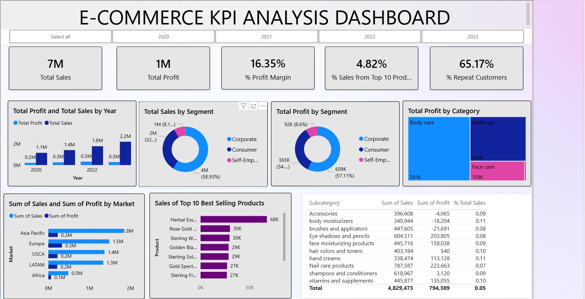
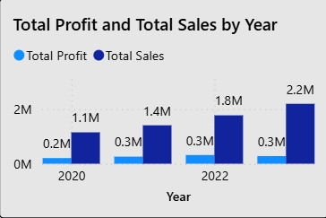
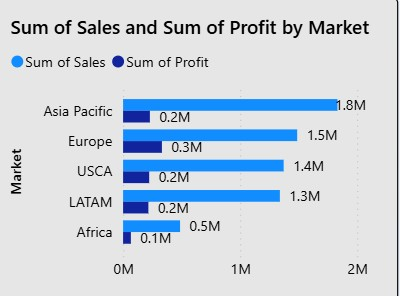

# E-commerce-KPI-Analysis-Dashboard
This is a data analytics project that focuses on Dashboard building using Power BI to generate actionable insights that drive strategic decision-making for an E-store's future growth.

## Table of Contents

- [Project Overview](#project-overview)
- [Data Source & Collection](#data-source-&-collection)
- [Data Cleaning & Prep](#data-cleaning-&-prep)
- [Analytics & Modeling](#analytics-&-modeling)
- [Dashboard Screenshots](#dashboard-screenshots)
- [Usage Instructions](#usage-instructions)
- [Key Findings & Recommendations](#key-findings-&-recommendations)
- [Limitations & Next Steps](#limitations-&-next-steps)
- [License & Credits](#license-&-credits)

### 1. Project Overview
- This project is about sales data from a skincare and beauty E-commerce global store  
- The object of this project is to generate insights about the market, product, customers, and sales, etc
- The main objective is to create a comprehensive Power BI report using the data from the global skin care and beauty shop.
- This report analyzes sales volumes and profitability across various product groups and markets, focusing on key performance indicators (KPIs) critical to the e-store's success
- Specifically, the e-store aims to achieve an average annual profit margin of 15% across all product groups
- It also aims to achieve 20% annual overall sales growth with a higher target of 30% for the corporate segment, and at least $400K in annual sales for each market

### 2. Data Source & Collection
- The data for this study was collected from the FP20 Analytics website, specifically challenge 19.
- This is the link to the website .........

### 3. Data Cleaning & Prep
- Data was cleaned in the Power Query Editor of Power BI 
- Firstly, the year and month columns were extracted from the order date column using the Power Query editor
- The profit margin was also calculated
- A column for the customer order count  was created to calculate and identify the % repeated customers
- Handling missing or incorrect data

### 4. Analytics & Modeling
- The DAx measure was used to calculate the % profit margin to show how much profit the business makes for every dollar of revenue 
- % of repeat customers was calculated to understand customer loyalty and satisfaction
- The percentage of total sales spent by a customer was calculated to understand how much individual customers or segments contribute to your revenue
- Measures and KPIs (DAX logic)
- Segment/category insights

### 5. Dashboard Screenshots
- ### E-commerce Dashboard

- ### Profit and Sales by Year Bar Chart

-
- ### Sum of Sales and Sum of Profit by Market chart
-  
-
- ### Profit by Segment Pie Chart
  
-
- Short caption explaining purpose

### 6. Usage Instructions
- How to open a `.pbix` file or view a Power BI template
- Requirements (Power BI Desktop version, etc.)

### 7. Key Findings & Recommendations
- The total sales across the three years are 7 million
- The total profit is 1 million
- The (%) percentage profit margin is 16.35%
- The % percentage of repeat customers is 65.17% meaning more than half of the customers return to shop again after their first purchase
- The profit by segment shows that people who work cooperatively generate the most profit
- The top 10 best-selling products generate 4.83% of the % total sales, meaning the total sales of 7 million is spread across the numerous products of the global store
- Summary of high-level business insights
- Any quantitative conclusions

### 8. Limitations & Next Steps
- This data from FP20 analytics is well structured and very easy to use amd did not require a lot of cleaning. 
- Just a few of the columns had to be renamed 
- Data quality considerations
- Suggested enhancements

### 9. License & Credits
- Acknowledgment of collaborators or tools
