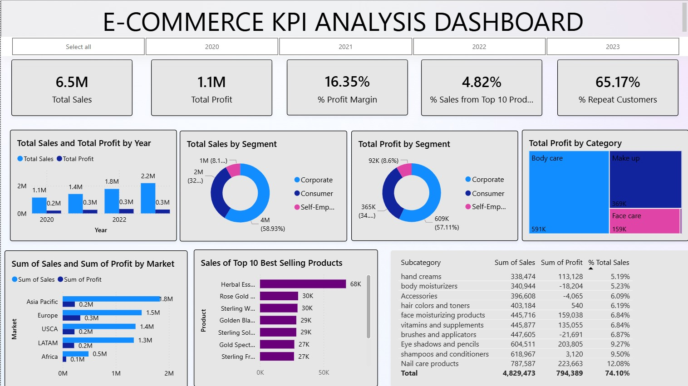
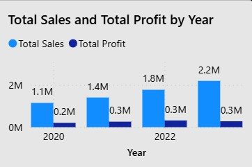
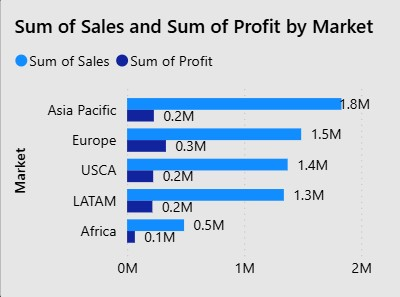

# E-commerce-KPI-Analysis-Dashboard
This data analytics project showcases a comprehensive Power BI dashboard designed to generate actionable insights that drive strategic decision-making for the future growth of an online skincare and beauty store.

## Table of Contents

- [Project Overview](#project-overview)
- [Data Source & Collection](#data-source-&-collection)
- [Data Cleaning & Prep](#data-cleaning-&-prep)
- [Analytics & Modeling](#analytics-&-modeling)
- [Dashboard Screenshots](#dashboard-screenshots)
- [Usage Instructions](#usage-instructions)
- [Key Findings & Recommendations](#key-findings-&-recommendations)
- [Limitations & Next Steps](#limitations-&-next-steps)
- [License & Credits](#license-&-credits)

### 1. Project Overview
This project focuses on analyzing sales data from a global skincare and beauty e-commerce store. The main goal is to develop a dynamic Power BI dashboard that offers insights into customer behavior, market trends, product performance, and overall business profitability.

Key business goals include:

- Achieving an average annual profit margin of **15%** across all product groups

- Driving **20% annual overall sales growth**, with a **30% growth target** for the corporate segment

- Generating at least **$400K in annual sales per market**

The dashboard highlights KPIs and visual insights that help evaluate progress towards these targets.

### 2. Dashboard Screenshots
 ### E-commerce Dashboard
 
 
 ### Profit and Sales by Year Bar Chart
 
 
 ### Sum of Sales and Sum of Profit by Market chart
 

### 3. Data Source & Collection
- Data was sourced from the [FP20 Analytics](https://fp20analytics.com/datasets/) platform, specifically from **Challenge 19**.
- The dataset contains sales records including order dates, product categories, customer segments, and financial metrics.

### 4. Data Cleaning & Prep
All data preparation and transformation were performed in **Power BI's Power Query Editor**:

- Extracted **Year** and **Month** columns from the "Order Date" field for time-based analysis

- Calculated a **Profit Margin** column

- Created a custom column to identify **repeat customer orders** for customer loyalty analysis

- Removed or corrected missing and inconsistent data entries

- Renamed columns for clarity and standardization

### 5. Analytics & Modeling
Key measures and KPIs were developed using **DAX (Data Analysis Expressions)** in Power BI:

- **% Profit Margin:** Indicates how much profit is earned per dollar of revenue

- **% Repeat Customers:** Measures customer retention and loyalty

- **% of Sales by Customer:** Highlights how much individual customers or customer segments contribute to total revenue

- Visual and interactive elements reveal performance across product categories, customer segments, markets, and periods

### 6. Usage Instructions
To view and interact with this dashboard:
 1. Download **Power BI Desktop** from the [official Microsoft website](https://www.microsoft.com/en-gb/).
 2. Open the .pbix file included in this project repository (E-commerce KPI analysis Dashboard.pbix).
 3. Use the slicers and filters provided (such as the **Year Filter** at the top) to dynamically explore data insights across different timeframes and segments.

This dashboard is best viewed using **Power BI Desktop version 2.130 or later**.

### 7. Key Findings & Recommendations
- **Total Sales** over the three years exceeded **$7 million**
- **Total Profit** amounted to approximately **$1 million**
- The **average profit margin** stood at 16.35%, exceeding the company’s 15% target
- **Repeat customers** accounted for **65.17%** of all orders, indicating strong customer loyalty
- The **corporate customer segment** generated the highest profit among all segments
- The **top 10 best-selling products** contributed just **4.83%** of total sales, suggesting that sales are well-distributed across a wide range of products

**Recommendations:**
- Maintain focus on customer retention strategies to keep repeat rates high
- Explore opportunities to increase sales concentration among top-performing products
- Expand profitable corporate segment through targeted promotions

### 8. Limitations & Next Steps
**Limitations:**

- The dataset was relatively clean and structured, so limited preprocessing was required
- No customer demographic data was included, which could have added more personalized insights

**Next Steps:**

- Incorporate customer **satisfaction surveys** or feedback data to enhance retention analysis
- Integrate **web traffic data** to correlate online behavior with purchase trends
- Deploy the dashboard to the **Power BI Service** for real-time data updates and sharing

### 9. License & Credits
- This project was built using **Microsoft Power BI**, with data provided by **FP20 Analytics**.
- Dashboard and analysis by **Cyril Obeng-Darko** as part of a personal data analytics portfolio project.
- Special thanks to the Power BI and data analytics communities for resources and guidance.

